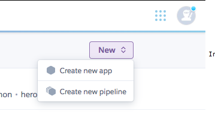
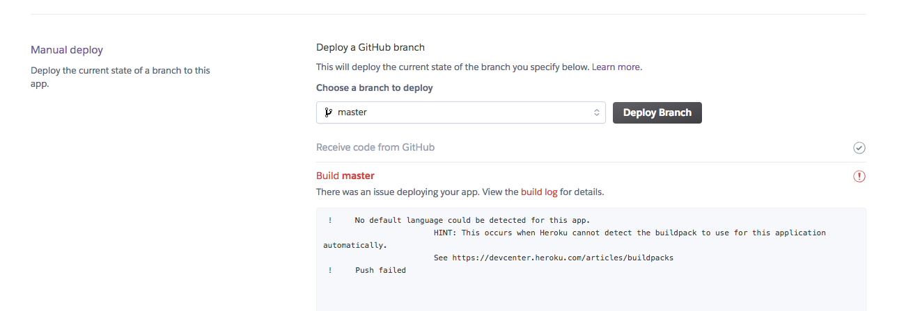
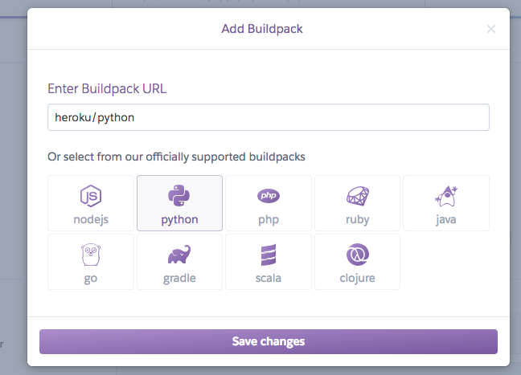
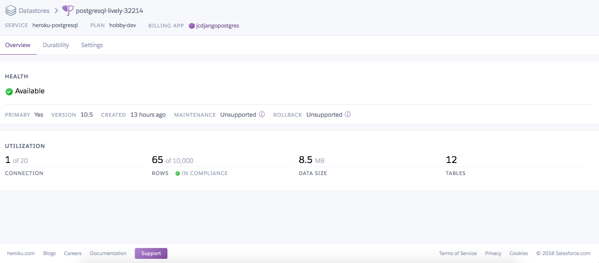

# Django + Postgres + Heroku + Travis Project Example

This django-tutorial aims to provide a nice template for developing a django-based API that feeds into a postgres database. After looking at the code and reading the walkthrough tutorial, hopefully you will feel more comfortable with running a django application in a variety of environments, in an integrated pipeline. 

### Virtual Environment 

Assumes you have python3...

1. Fork the repo on github to get a copy of the respository, and then cloned that newly forked repo with `git clone`
2. Create a virtual environment with the  `python -m venv .venv` .This will a sandboxed environment called "venv" that helps with controlling dependencies.
3. Activate the environment with `source .venv/bin/activate`
4. Install all the application's dependencies (while in the activated virtual environment) with `pip install -r requirements.txt`.

### Database

Since we want to use postgres as our production database, we should make sure that any local development is also done with postgres. Setting postgres up to run on a machine locally is more of a hassle than the default 'db.sqlite3' database that django, but using it locally ensures that no weird errors crop up by having different database implementations across environments development and production environments.

##### Note
A point can be made that once a production database is established, it's easier to develop locally, but make external requests to the production database. While this might make sense for a bit, there will come a point when the production database is sacred, and the threat of potentially wrecking it in some fashion with local development is too great. Working locally with postgres gives a nice sandboxed database that be destroyed and recreated at will. 

### To Setup up Postgres Locally on a Mac

1. Install [homebrew](https://brew.sh/) if it's not already on your Mac.
2. Update brew with `brew update`.
3. Install postgres with `brew install postgres`.
4. To start postgres consistently run in the background, use the command `brew services start postgresql`. If you'd prefer to start it manually and not have it automatically start use `pg_ctl -D /usr/local/var/postgres start`.
5. Make sure that everything is working properly by entering postgres's command line interface with `psql postgres`. You should see you enter a shell that looks like `postgres=#`.
6. Once in the interface, create a new database named djangotutorial with the command `CREATE DATABASE djangotutorial;` If creating the database succeeds, you will see the response `CREATE DATABASE`. This will be the database that our django application will connect and write to for local development. 
7. For anyone to connect and access the database we created, they need a valid postgres username and password combination. This means that we need to create a dedicated user for django to interact with our new database. We create it with  `CREATE USER djangotutorial WITH PASSWORD 'supersecret';` 
8. Our new postgres user needs explicit permission to have read and write capabilities on our newly created database. We can do that with the command `GRANT ALL PRIVILEGES ON DATABASE "jumbocode" to djangotutorial;` .  

This is all that's needed to set up local development for postgres. Now we need to let django know how to connect to the database during local development. We define this connection in the file `/django_postgres_example/settings/dev.py`.
 
The last thing then we need to do, is set an environment variable that lets django know that we want to use the "dev"elopment settings in this environment. We do this with the command `export DJANGO_SETTINGS_MODULE=django_postgres_example.settings.dev`. 

#### Further Resources

* [Optimizing Postgres Configuration](https://docs.djangoproject.com/en/2.1/ref/databases/#optimizing-postgresql-s-configuration)
* [The Library that drives the connection between django to postgres](http://initd.org/psycopg/docs/install.html)
* [Good Overview of Relational Database Fundamental Concepts](https://www.postgresql.org/docs/8.4/static/tutorial-concepts.html)
* [How to Create a Data Schema in raw sql](https://www.postgresql.org/docs/8.4/static/tutorial-table.html)
* [How to insert new data in raw sql](https://www.postgresql.org/docs/8.4/static/tutorial-populate.html)

### Environments and Settings

The local development environment is only of many different environments that your code can run in. I find it useful to create a seperate file in the settings directory for each environment that your code many run in.

* `settings/dev.py` specifies your application settings for a local development environment. 
* `settings/prod.py` specifies your application settings for a production environment (the service your real users will using) 
* `settings/travis.py` specifies your application settings from runnnning in Travis CI, a 3rd party testing utility that is talked about later on in the tutorial. 

Different environments might share some common settings so we include them with `settings/common.py`, but they also might have different characteristics. Ie. The database settings are different / security consdierations being less of a factor for local development. 

No matter what our environment is though, we need to tell it what settings file to use. Setting the `DJANGO_SETTINGS_MODULE` variable with the `export` utility tells the envionment which settings to use so that everything runs properly. Since we already set the `DJANGO_SETTINGS_MODULE` environment variable to our (dev)elopment settings, file, we can move to migrating the database and getting our api up and running locally. 

### Run API Locally

If everything has gone according to plan, only 3 steps are need to needed to run the server in its current state.

1. Run `python manage.py makemigrations` to see how/if old data can be translated to a newer representation.
2. Run `python manage.py migrate` actually translate the database to the most up to date representation
3.  Run `python manage.py runserver` simply starts the server on localhost

Anytime there are changes to `models.py`, running steps 1-3 will try to seemlessly translate those changes to your connected database. 

At this point, it might be worth clarifying Django's relationship with the postgress database. Basically django sits as a middleware translator between your python code in models.py and the raw, postgres queries that actually do the barebones work. Similar to how we created a user and a database with the postgres prompt, you can also create other datastructures and relationships with postgres queries. What django does is simply package that same functionality into cleaner "model" python code.

##### Your Code in Models.py ------> Django's ObjectRelatedMapper ---> Generated Postgres Queries/Statements --->  The Raw Data and Schema.

#### Test API Locally

Now we can start the server, but how do we know if it's in good shape? In `/api/tests/tests.py` we've defined a couple tests that our api should pass for correct functionality. We can make sure those currently pass by running them locally `python manage.py test api`. 
Before we can do that though, we need to enter the psql prompt again `psql jumbocode` and give our user access to create a temporary runtime database for testing with `=> ALTER USER django CREATEDB;`. This means that our tests won't affect our local database.

### Let's Move to Production!

Now that we've established that our simple api is working properly in a local environment, let's put it on some production machines.  

Assuming you already have a [heroku](https://dashboard.heroku.com). Create
a new app with whatever name for the tutorial you want. 

Then, link the repository, so that every push to your master branch on github deploys the most up to date version seemlessly on Heroku.

If github permissions are configured properly, you should be able to easily find your forked repo on github and link it to heroku.  

#### Connect Database and Set Production Environment 

If we try to manually deploy though, we run into issues. 

That's because Heroku has different requirements for running a django application in their environment. In order for Django to play nicely in a heroku, production environment you need.

1. A python buildpack installed. This tells heroku that we are building a python application so it knows to look for certain files like 'requirements.txt'. Install a python buildpack with the following steps: 
    1. Go to your app's 'settings' table and scroll down to the buildpack section. 
    2. Select the official python supported pack and save the changes, you should now see the buildback added.  
2. A Procfile, which tells heroku what command to run your application.
    * Our procfile is just the line `web: gunicorn django_postgres_example.wsgi` The `web:` tells heroku it's a web application. The web application is served by the webserver (the thing that actually runs your application) package `gunicorn` and gunicorn looks for our applications `.wsgi` file
3. A `runtime.txt` file that specifies the python version we want to use in production.

We also need to configure and connect a production database that isn't just running on our local machine. Thankfully Heroku comes with postgres available as an addon.

We simply navigate to our app's resource tab, search for postgres, and add it. 

Not only will the add-on seamlessly handle the provisioning of the database, it will automatically add the necessary database credentials as Heroku environment variables.  

Navigate to the settings tab on your  heroku app, and click the "Reveal Congfig Vars Section"

That should give you something like this: 

Your postgres information should have already been populated with the addon. You should also set values for the two other variables `SECRET_KEY` and `DJANGO_SETTINGS_MODULE`. Just like we set `DJANGO_SETTING_MOUDLE` to `django_postgres_tutorial.settings.dev` in our local environment, we do the same thing here with `django_postgres_tutorial.prod`. 
Heroku config vars are a good way to cleanly store sensitive, environment specific, variables. The accessing and usage of these environments variables is stated in our production setting file `django_postgres_tutorial/settomgs/prod.py`. Set a secret and you should be good to go!!

Now let's manually deploy our app in production see it works with our environment variables and production settings! 

Navigate to the "deploy" tab on your app, scroll down to "manual deploy" and click "deploy branch" 

##### Hit the Production API

Make sure you've done everything correctly by hitting the production api route, [https://jcdjangopostgres.herokuapp.com/api/sleds/](https://jcdjangopostgres.herokuapp.com/api/sleds/) and see if your list sleds gets returned. Hopefully it works!

##### Notes and Other Resources

* https://devcenter.heroku.com/articles/django-app-configuration
* https://devcenter.heroku.com/articles/python-concurrency-and-database-connections
* [Procfiles](https://devcenter.heroku.com/articles/procfile)
* [How Heroku Works](https://devcenter.heroku.com/articles/how-heroku-works)
* [Gunicorn](https://docs.djangoproject.com/en/2.1/howto/deployment/wsgi/gunicorn/)
* [Web Server vs. Application](https://www.javaworld.com/article/2077354/learn-java/app-server-web-server-what-s-the-difference.html)
* [Python Versioning and Runtimes in Heroku](https://devcenter.heroku.com/articles/python-runtimes)
* [Django Secret Key Generator](https://www.miniwebtool.com/django-secret-key-generator/)

### Connect Travis Testing Integration

We've confirmed that our production environment is up and running in some capacity. But how do we make sure it's kept clean and without bugs? Travis Continuous Integration is a helpful 3rd party service that tests your code before it goes to your production environment. Just as we can our tests locally with `python manage.py test api`, travis gives us a way to do that automatically every time code is pushed to master. Travis runs whatever tests we tell it to, and if our new changes fail to pass our tests, Travis will stop our changes from making it into production. 

1. Create a Travis Account (I do mine through Github) and link with Github 
2. Link the repositories you care about. Depending on how your Github account is configured, this interface might either be on Github or Travis.  No matter what, find your forked repo and give Travis access. 
3. On the heroku app, check the box that link up continuous integration.[heroku_travis_link](./screenshots/travis_link_repo.png)

Manually deploy the application again, and if everything worked, you should see passing tests in your travis build and a successful deploy to heroku.
Travis needs 2 files to run properly in this architecture: 
 
1. A `.travis.yml` file that specifies how you want travis to build and test your application. This file contains things like python versions to run in and build instructions.
2. A `django_postgres_example.settings.travis` file that species the django settings for Travis. This largely is just the database connection information that travis needs. 

[successful_travis_build](./screenshots/travis_build_passing.png)

##### Notes and Resources
* [Beginner Continuous Integration Concepts](https://docs.travis-ci.com/user/for-beginners/) 

### What Now?

Now that we are deployed and have continuous testing setup, what should we do from here?

#### Access Your Production Server

Just like you can run commands locally, you can run commands on you deployed heroku server... Just be careful..

If you don't already have the heroku toolbelt, download it from [here](https://devcenter.heroku.com/categories/command-line).

Once installed, gain access with:
1. `heroku login`  
    * 
2. Set the heroku remote with `heroku git:remote -a jcdjangopostgres`
3. Now you run any command on your deployed server with `heroku run < your command here >`
    * eg. `heroku run ls` (It's the same ls command we all know and love)
4. You can look at the production server logs with `heroku log`

4. Let's migrate the production database we connnected! `heroku run python manage.py migrate`
    * 
       
5. Load your sample data with `heroku run python manage.py loaddata data.json`. Similar to local development, this populates your production database with dummy data. 

##### Want to SSH in? 

One off commands might be useful enough, but what if you want a persistent ssh session? 

Just use the heroku command `heroku ps:exec` which will allow you to get a shell session on your heroku dyno. 

#### Examine the Production Database

Maybe you're curious about the production postgres database that we connected. Since we installed postgres as a heroku addon, one way to examine the database is through their website. Most of the really nice features (eg. automatic backups of the database) aren't for free accounts, but you can still see what options are presented by clicking on the '
Heroku Postgres :: Database' add-on we added earlier. Clicking through will take you to the database interface.

What, if for whatever reason, you want a raw postgres shell on your production database, similar to how we used a shell with our local postgres database. We can enter a similar shell on our remote, production database with  `heroku pg:psql`

#### Notes and Resources 

* [Basics for Postgres on Heroku](https://devcenter.heroku.com/categories/postgres-basics)
* [Using the Heroku Postgres CLI](https://devcenter.heroku.com/articles/heroku-postgresql#using-the-cli)

